# 🤖 AI Project Topic Recommender

An intelligent recommendation system that helps students discover AI project ideas based on their interests, skills, preferred domain, and difficulty level.

Instead of spending hours searching for project ideas online, users can simply enter their preferences and receive personalized AI project recommendations with an explanation of why each project matches their profile.

---

## ✨ Features

- Personalized AI project recommendations
- Natural Language Processing (NLP) based text preprocessing
- TF-IDF Vectorization for project matching
- Cosine Similarity for recommendation scoring
- Match percentage for every recommendation
- Explainable AI (Why this project was recommended)
- Skill Gap Analysis
- Learning resource suggestions
- Export recommendations to CSV
- Automatically generate a dataset of AI projects

---

## 🛠️ Technologies Used

- Python
- Pandas
- NumPy
- NLTK
- Scikit-learn
- TF-IDF Vectorizer
- Cosine Similarity
- CSV Dataset

---

## 📂 Project Structure

```text
AI-Project-Topic-Recommender/
│
├── app.py
├── recommender.py
├── preprocessing.py
├── utils.py
├── generate_dataset.py
├── requirements.txt
├── README.md
├── LICENSE
├── .gitignore
│
├── dataset/
│   └── project_topics.csv
│
└── screenshots/
```

---

## 🚀 How It Works

1. The user enters their details.
2. Selects interests and skills.
3. Chooses a preferred domain.
4. Selects the difficulty level.
5. The system preprocesses the input using NLP.
6. TF-IDF converts text into numerical vectors.
7. Cosine Similarity finds the most relevant projects.
8. The system displays the top recommendations along with:
   - Match Percentage
   - Why Recommended
   - Skill Gap Analysis
   - Suggested Learning Resources

---

## 📸 Screenshots

### 🏠 Home Screen

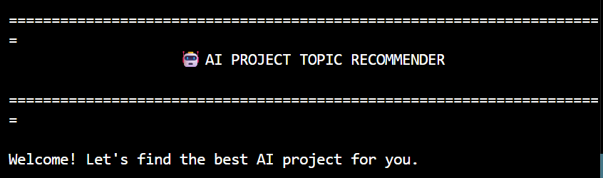

---

### 👤 User Details

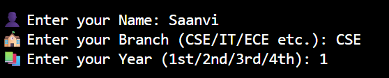

---

### ❤️ Interest Selection

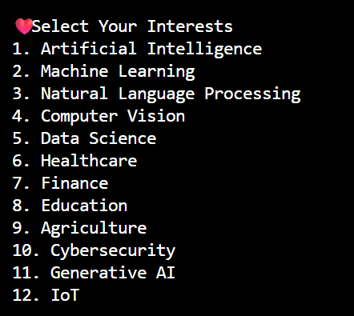

---

### 💻 Skills Selection

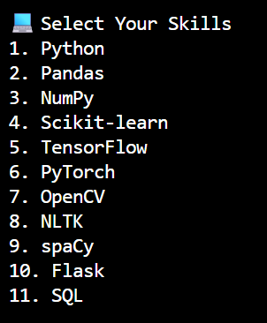

---

### 🌍 Domain Selection

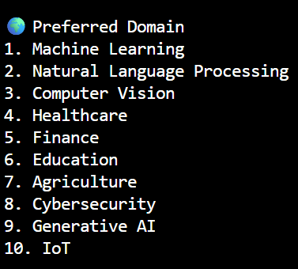

---

### 🎯 Difficulty Selection

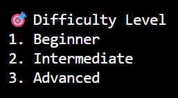

---

### 📌 Top Recommendations

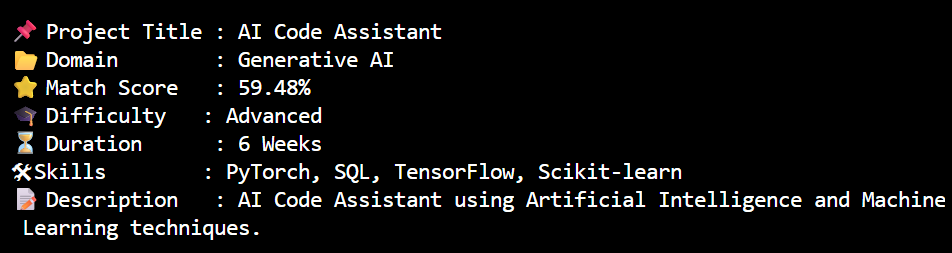

---

### 💡 Why Recommended

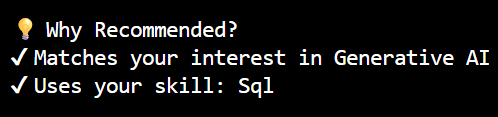

---

### 📚 Skill Gap Analysis

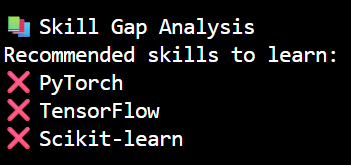

---

### 📖 Learning Resources

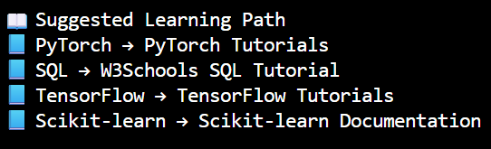

---

### 💾 Save Recommendations

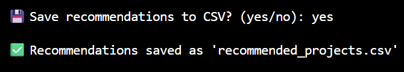

---

## ▶️ Installation

Clone the repository

```bash
git clone https://github.com/your-username/AI-Project-Topic-Recommender.git
```

Go to the project folder

```bash
cd AI-Project-Topic-Recommender
```

Install dependencies

```bash
pip install -r requirements.txt
```

Generate the dataset

```bash
python generate_dataset.py
```

Run the project

```bash
python app.py
```

---

## 📊 Sample Output

```text
Project Title : Heart Disease Prediction

Match Score : 96%

Why Recommended?

✔ Matches your interests

✔ Uses your Python skills

✔ Matches your preferred difficulty

Skill Gap

❌ TensorFlow

❌ Flask

Suggested Learning Resources

📘 TensorFlow Tutorials

📘 Flask Documentation
```

---

## 🔮 Future Improvements

Some ideas to enhance this project in the future:

- Add a graphical user interface using Tkinter or Streamlit
- Connect with a real project database
- Add project difficulty prediction using Machine Learning
- Include project roadmaps and learning paths
- Save user profiles for personalized recommendations
- Deploy the project as a web application

---

## 👩‍💻 Author

**Priyanshi Trehan**

B.Tech CSE Student  
Maharaja Surajmal Institute of Technology (MSIT)

Passionate about Artificial Intelligence, Machine Learning, and building practical projects that solve real-world problems.

---

## ⭐ If you found this project helpful

If you like this project, consider giving it a ⭐ on GitHub. It helps others discover the project and motivates future improvements.

---

## 📜 License

This project is licensed under the MIT License.